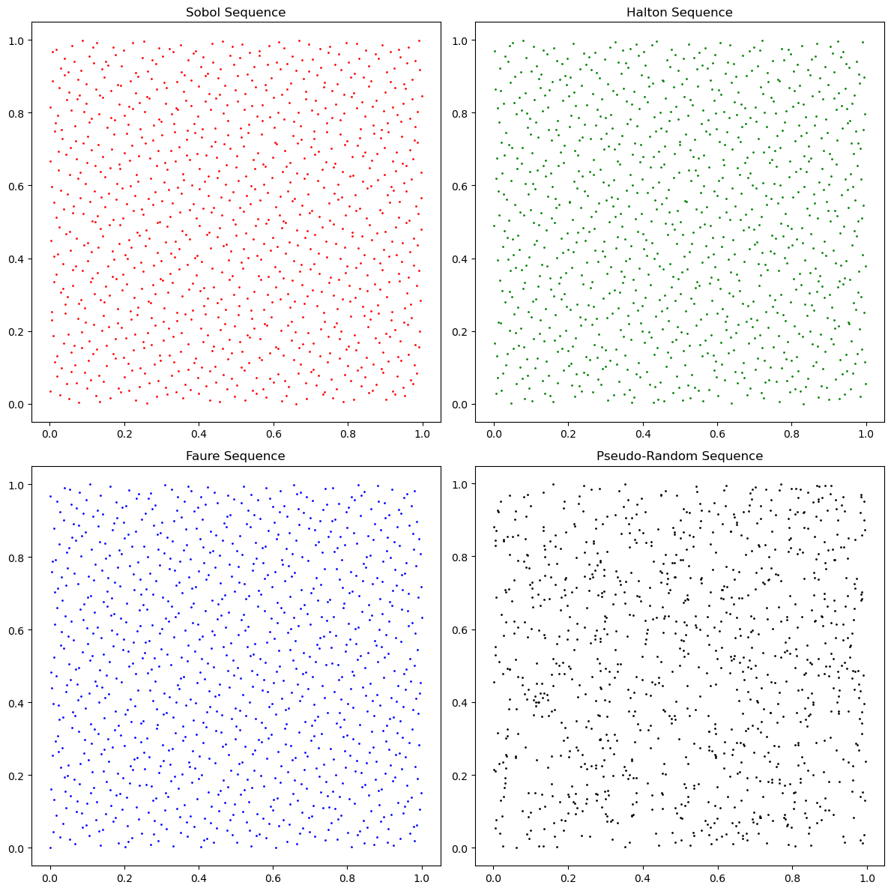

# **Low-Discrepancy Sequences in Action: A Monte Carlo Comparison of Quasi-Random vs. Pseudo-Random Sampling**

## **Table of Contents**
1. [Problem Statement](#1-problem-statement)  
2. [Data Source](#2-data-source)  
3. [Data Cleaning & Preprocessing](#3-data-cleaning--preprocessing)  
4. [Exploratory Data Analysis (EDA)](#4-exploratory-data-analysis-eda)  
5. [Modeling Approach](#5-modeling-approach)  
6. [Evaluation Metrics](#6-evaluation-metrics)  
7. [Outcome](#7-outcome)  
8. [Tools Used](#8-tools-used)  
9. [Business Impact / Use Case](#9-business-impact--use-case)

---

## **1. Problem Statement**  
This project explores how quasi-random sequences compare to traditional pseudo-random sequences in Monte Carlo integration tasks. The focus is on evaluating how well each sequence type covers a 2D unit hypercube and how that impacts integration accuracy and variance. The goal is to provide insight into which sampling method is more effective for numerical simulations, especially those used in scientific and engineering applications.

---

## **2. Data Source**  
This is a synthetic study. All data (random and quasi-random sequences) are generated programmatically within a 2D unit hypercube \([0, 1] \times [0, 1]\). Sequences include:

- **Sobol** (via `scipy.stats.qmc.Sobol`)  
- **Halton** (via `scipy.stats.qmc.Halton`)  
- **Faure** (via custom implementation)  
- **Pseudo-Random** (via `numpy.random.rand`)

Each sequence contains 1,000 points and is used for both uniformity and integration comparisons.

---

## **3. Data Cleaning & Preprocessing**  
All sequences were generated cleanly within bounds, so minimal preprocessing was required. Preprocessing steps included:

- Validating that all points fall within \([0, 1]^2\)  
- Normalizing values where needed (e.g., Faure sequence)  
- Ensuring consistent dimensionality and shape  
- Applying each point set to the test function \(f(x, y) = x^2 + y^2\)

No missing data, outliers, or transformation issues were present.

---

## **4. Exploratory Data Analysis (EDA)**  

### **Discrepancy Value Table**  
Discrepancy measures how uniformly points are distributed. Lower values mean better coverage.

| Sequence Type           | Discrepancy Value |
|-------------------------|-------------------|
| Sobol Sequence          | 1.5929e-06        |
| Halton Sequence         | 2.1981e-06        |
| Faure Sequence          | 3.4823e-06        |
| Pseudo-Random Sequence  | 1.0118e-03        |

### **Monte Carlo Integration Values**  
Results are based on averaging \(f(x, y) = x^2 + y^2\) over 1,000 samples. The expected value is \( \frac{2}{3} \approx 0.6667 \).

| Sequence Type           | Integration Result |
|-------------------------|--------------------|
| Sobol Sequence          | 0.666278           |
| Halton Sequence         | 0.666328           |
| Faure Sequence          | 0.665979           |
| Pseudo-Random Sequence  | 0.654316           |

---

## **5. Modeling Approach**  
Instead of training models, this project uses sampling methods as the "model" to evaluate their accuracy in numerical estimation.

Steps included:
- Generating 1,000 2D points per sequence  
- Evaluating the integral \(f(x, y) = x^2 + y^2\) using the sample mean  
- Calculating discrepancy to assess coverage uniformity

This allowed a controlled comparison of sampling efficiency.

---

## **6. Evaluation Metrics**

- **Discrepancy**: A statistical measure of uniformity across the hypercube  
- **Integration Accuracy**: How close the sample mean of the test function is to the expected value  
- **Variance (implicit)**: Assessed through consistency of results across sequences  
- **Visual Uniformity**: Through 2D scatterplots of the sampled points

---

## **7. Outcome**

### **Visual Comparison of Sampling Distributions**  
The figure below shows the 2D scatter plots of the 1,000 points generated for each sequence. It highlights the differences in distribution uniformity between quasi-random and pseudo-random sampling methods.

From visual inspection:
- **Quasi-random sequences** (Sobol, Halton, Faure) appear more evenly spaced  
- **Pseudo-random sequence** shows noticeable clustering and gaps

### **Accuracy and Uniformity Comparison**  
- **Quasi-random sequences** consistently show:
  - Lower discrepancy  
  - Higher integration accuracy  
  - More uniform point distribution

- **Pseudo-random sequence** yields:
  - Higher discrepancy  
  - Underestimated integral  
  - Visibly uneven coverage

---

## **8. Tools Used**

- **Python**: Core language  
- **NumPy**: Numerical operations and pseudo-random generation  
- **SciPy**: Sobol, Halton sequences and discrepancy analysis  
- **Matplotlib**: Visualization of distributions  
- **Custom Functions**: Faure sequence logic, integration functions

---

## **9. Business Impact / Use Case**

This study supports more effective numerical estimation strategies in:

- **Financial modeling** (e.g., pricing options with less variance)  
- **Scientific simulations** (e.g., particle behavior)  
- **Engineering problems** (e.g., design optimization)  
- **Monte Carlo rendering** (e.g., reducing visual noise in CG applications)

These findings highlight when and why to replace traditional pseudo-random sampling with structured, deterministic low-discrepancy methods.
